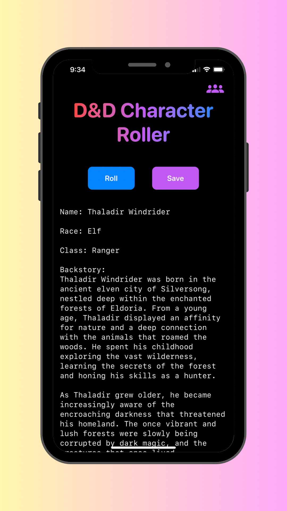
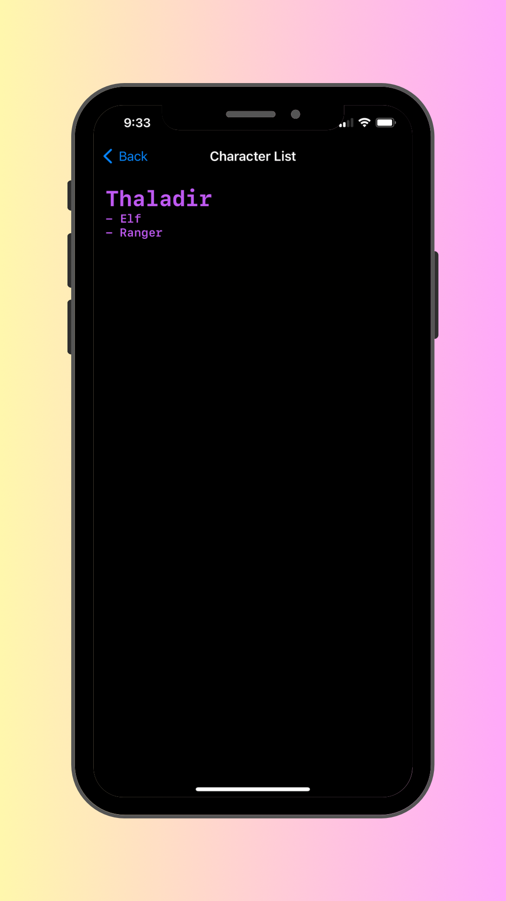

# Tabletop Character Roller

Over the last two weeks I’ve been working on a new project. It’s nothing big or novel. It’s actually a pretty small app - just three screens and two features. I actually almost let that stop me from releasing it. 

It can be hard for an idea to qualify as “good enough” sometimes, but really the only person you need to square that with is yourself!

Let’s dive in.

---

I’ve been interested in checking out the ChatGPT API recently. I’ve also been interested in running an experiment on a paid up front app. These things came together into one idea: A Dungeons & Dragons character generator. I enjoy a good tabletop campaign, but sometimes I just want a deep character to role-play without diving into the lore and source materials to create the backstory myself.

I saw this app having two features:

- The user can generate a random character
- The user can save and see previously -generated character

These two features break down into just three screens…






While we’re at it, this is what our character model looks like:

```swift
struct Character: Codable, Identifiable {
    var name: String
    var race: String
    var characterClass: String
    var backstory: String

    var id: String {
        return String(backstory.hashValue)
    }
}
```

For the API calls, I really wanted to try out one of the Swift libraries. There are a few options here, but I went with one I already knew about - [OpenAIKit](https://github.com/dylanshine/openai-kit) from Dylan Shine. The library has minimal boilerplate to get things set up and we’re just going to be using it for a single chat prompt per tap of our “Roll” button. 

Here’s the class that our view model will use to get the character text:

```swift
import OpenAIKit
import NIOPosix
import AsyncHTTPClient

class OpenAIAPI {
    let httpClient: HTTPClient
    let eventLoopGroup = MultiThreadedEventLoopGroup(numberOfThreads: 1)
    let openAIClient: OpenAIKit.Client
    let prompt = "Generate a Dungeons & Dragons Character with Race, a Race-Accurate Name, Class, and Backstory"

    init() {
        let key = "NotSoFastMyFriend"
        let org = "OrganizationIsTheFoundationOfHappiness"
        let configuration = Configuration(apiKey: key, organization: org)

        self.httpClient = HTTPClient(eventLoopGroupProvider: .shared(eventLoopGroup))
        self.openAIClient = OpenAIKit.Client(httpClient: httpClient, configuration: configuration)
    }

    func chat() async -> String {
        do {
            let completion = try await openAIClient.chats.create(
                model: Model.gpt3_5turbo,
                messages: [Chat.Message.user(content: prompt)]
            )
            return completion.choices.first?.message.content ?? ""
        } catch {
            print(error)
        }
        return ""
    }
}

```

The view model:

```swift
import Foundation
import SwiftUI

@MainActor
class CRViewModel: ObservableObject {
    public var character: CRCharacter = CRCharacter()
    @Published public var characterString: String = ""
    var client = OpenAIAPI()

    func getCharacter() async {
        characterString = await client.chat()

        let characterDetails = parseCharacterDetails(characterString)
        self.character = CRCharacter(name: characterDetails.name,
                                     race: characterDetails.race,
                                     characterClass: characterDetails.charClass,
                                     backstory: characterDetails.backstory)
    }

    func reset() {
        self.character = CRCharacter()
        self.characterString = ""
    }
}
```

Let’s talk about this class a bit

`character: CRCharacter` - object that our view will use to create the Character entity that is saved to CoreData.

`characterString: String` - string that our OpenAI API response is saved to. This is the string that our view will display.

`parseCharacterDetails(_: String)` - function that parses out the name, race, class, and backstory string values from the ChatGPT response. Funny enough, ChatGPT helped me write this function.

`getCharacter()` - an async function that our view calls when the “Roll” button is tapped.

`reset()` - function that clears out the current values after the “Save” button is tapped.

Let’s take a look at how we’re using our view model in the main view - I won’t show the whole view, but I’ll highlight a few things

```swift
Button {
    let char = Character(context: managedObjectContext)
    char.name = viewModel.character.name
    char.race = viewModel.character.race
    char.characterClass = viewModel.character.characterClass
    char.backstory = viewModel.character.backstory

    PersistenceController.shared.save()

    viewModel.reset()
} label: {
    Text("Save")
        .frame(width: 75)
        .font(.headline)
        .fontDesign(.rounded)
        .foregroundColor(.white)
        .padding()
        .background(Color.purple)
        .cornerRadius(10)
}
.padding()
```

We’re using Core Data to save our Characters, so when the “Save” button is tapped, we create a Character entity using the NSManagedObjectContext from our view. Next, we save using our PersistenceController and reset the view model.

```swift
Button {
    Task {
        await viewModel.getCharacter()
    }
} label: {
    Text ("Roll")
        .frame(width: 75)
        .font(.headline)
        •fontDesign(.rounded)
        •foregroundColor(.white)
        •padding()
        •background(Color.blue)
        .cornerRadius(10)
}
.padding()
```

This is the Roll button - pretty similar to the save one.

The last button on the main view opens our character list

```swift
.toolbar {
    ToolbarItem(placement: .navigationBarTrailing) {
        NavigationLink {
            CharacterListView()
                .environment(\.managedobjectcontext, managedobjectContext)
        } label: {
            Image(systemName:"person.3. fill")
                .foregroundColor(.purple)
        }
    }
}
```

This is a pretty straightforward toolbar button setup. We’re using a NavigationLink with our CharacterListView as the destination. Since we’re using Core Data to save and load our Characters, we’re passing our managedObjectContext to the character list.

```swift
import Foundation
import SwiftUI
import Combine

struct CharacterListView: View {
    @Environment (\.managedobjectContext) var managedObjectContext
    @FetchRequest (sortDescriptors: [SortDescriptor(\.name)]) var characters: FetchedResults<Character>


    var body: some View {
        VStack {
            ScrollView {
                ForEach(characters) { character in
                    NavigationLink(destination: CharacterDetailView(character: character)) {
                        HStack {
                            VStack(alignment: .leading) {
                                Text(character.name)
                                    .bold()
                                    .fontDesign( .monospaced)
                                    .font(.title)
                                Text("- \(character.race)")
                                    .bold()
                                    .fontDesign( .monospaced)
                                    .font (.subheadline)
                                Text("- \(character.characerClass)")
                                    .bold()
                                    .fontDesign( .monospaced)
                                    .font (.subheadline)
                            }
                        }
                        Spacer()
                        Spacer()
                    }
                    .foregroundColor(.purple)
                    .padding()
                }
                .onDelete (perform: removeCharacter)
            }
        }
        .navigationBarTitle( "Character List")
    }

    func removeCharacter(at offsets: IndexSet) {
        for index in offsets {
            let char = characters[index]
            managedObjectContext.delete(char)
        }

        PersistenceController.shared.save()
    }
}

```

In our list view, we’re loading our characters using Core Data’s `@FetchRequest` and using a `ForEach` with more `NavigationLinks` with `CharacterDetailView` as the destination.

I’ve already posted enough code here and the `CharacterDetailView` is pretty basic, so I won’t show it. 

But that’s it.

---

So what’s the point this week? To show off how fast I can build an app? No, of course not. And I didn’t even build this very fast!

The point this week is that solving a single problem or annoyance is more than enough. The app I showed you the code for today I’ve listed on the [App Store](https://apps.apple.com/us/app/tabletop-character-roller/id6450459189) for $2.99. That price feels a slightly steep to me for what this app does, but I was worried $1.99 wouldn’t fully cover the cost per user of ChatGPT as the app grows organically. I’ve always heard you should price things higher than you first think, so we’re trying that out here.

It’s tough out there for paid up front apps these days, so we’ll see how things go. If needed, I can always add some more features down the road and convert it to a subscription model. The point this week is that you don’t have to have everything planned and figured out to release something.


---

I am not a designer, so I get a lot of help from tools when it comes to things like App Icons, App Store Screenshots, and App Store copy.

A few tools I’ve found great for releasing something fast are

- https://www.appicon.co
- https://screenshots.pro
- https://hotpot.ai/icon-resizer

These tools allow you to cut so much design time out of the release process, please check them out!

Happy coding!

Morgan Zellers