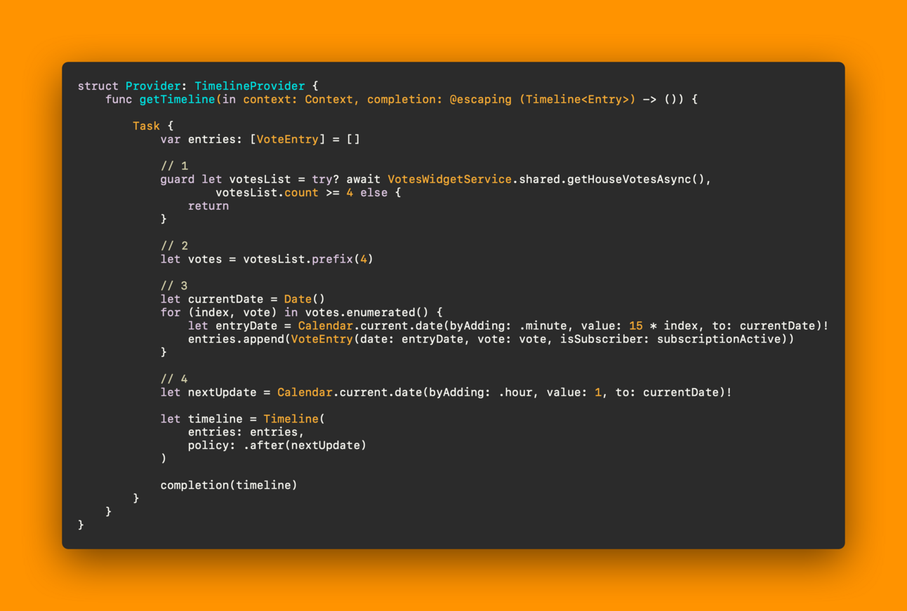
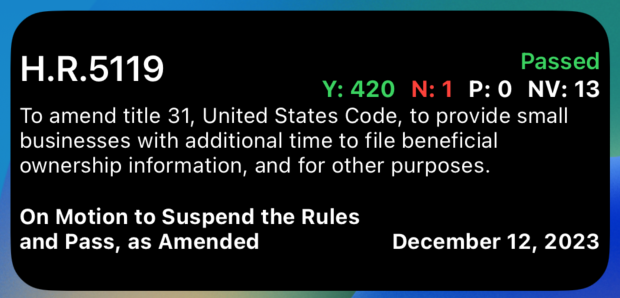

# Building a Widget in SwiftUI

One of the best features Apple offers us as developers to engage users and add long-lasting value for them is widgets. A great widget can keep users coming back to your app from their home screen and even be a premium selling point for a subscription upgrade or in-app purchase.

This walkthrough covers the basic steps to create a functional, dynamic widget in SwiftUI. By fetching and displaying real-time data, your widget can provide valuable information at a glance, enhancing the user experience. Remember, the key to a great widget is not just functionality but also an intuitive and appealing design that fits various widget sizes.

I’m going to walk through the process I followed to build a "Votes Widget" – a widget that displays the most recent votes from the House of Representatives in an upcoming version of my app Congress Vote Tracker.

## The Votes Widget

The Votes Widget displays information about the latest votes in the House of Representatives. This includes the bill's title, vote result, tally of votes, and other details. The widget will come in three sizes: small, medium, and large, each offering a different level of detail.

### Setting Up the Widget

In Xcode, select File → New → Target, search for “Widget Extension” and select it.

Choose a name that fits your widget. I’m naming this one VotesWidget.

You’ll get two files - VotesWidgetBundle and VotesWidget. The first is pretty simple…


```swift
import WidgetKit
import SwiftUI

@main
struct VotesWidgetBundle: WidgetBundle {
    var body: some Widget {
        VoteWidget()
    }
}
```

However, the VotesWidget file has quite a lot of boilerplate in it. Let’s break it down by struct.

```swift
struct SimpleEntry: TimelineEntry {
    let date: Date
}
```


We’ll start with the SimpleEntry struct. This type is going to be the main data type for your widget. It will hold a date and whatever other data you need to show on your widget. For more information, checkout Apple’s documentation on TimelineEntry.

I’m going to update mine with my Vote data type that holds information on congressional votes.


```swift
struct VoteEntry: TimelineEntry {
    let date: Date
    let vote: Vote
}
```


#### Timeline Provider

Next, let’s take a look a look at the Provider struct; there’s a lot there.

```swift
struct Provider: TimelineProvider {
    func placeholder (in context: Context) -> SimpleEntry {
        SimpleEntry(date: Date())
    }
    func getSnapshot (in context: Context, completion: @escaping (SimpleEntry) -> ()) {
        let entry = SimpleEntry (date: Date())
        completion (entrv)
    }

    func getTimeline (in context: Context, completion: @escaping (Timeline<Entry>) -> ()) {
        var entries: [SimpleEntry] = []

        // Generate a timeline consisting of five entries an hour apart, starting from the current date
        let currentDate = Date()
        for hourOffset in 0 ..< 5 {
            let entrvDate = Calendar.current.date (bvAdding: .hour, value: hourOffset, to: currentDate)!
            let entry = SimpleEntry(date: entryDate)
            entries.append(entrv)
        }

        let timeline = Timeline (entries: entries, policy: .atEnd)
        completion(timeline)
    }
}
```

#### Placeholder

The placeholder provides a TimelineEntry representing a placeholder version of the widget.

When WidgetKit displays your widget for the first time, it renders the widget's view as a placeholder. A placeholder view displays a generic representation of your widget, giving the user a general idea of what the widget shows. WidgetKit calls placeholder(in:) to request an entry representing the widget's placeholder configuration.

I’ll update my placeholder function to return sample Vote data for the widget.

```swift
struct Provider: TimelineProvider {
    func placeholder(in context: Context) -> VoteEntry {
        let vote = Vote(
            congress: 118, 
            chamber: "House",
            ...
            ...
        )

        return VoteEntry (date: Date(), vote: vote)
    }
}
```

#### Snapshot

Provides a timeline entry that represents the current time and state of a widget. WidgetKit calls getSnapshot(in:completion:) when the widget appears in transient situations. If context.isPreview is true, the widget appears in the widget gallery.

Most of the time when getSnapshot is being called will be in the widget gallery, so for this function, I return the same sample Vote.

```swift
struct Provider: TimelineProvider {
    func getSnapshot(in context: Context, completion: @escaping (VoteEntry) -> ()) {
        let vote = Vote(
            congress: 118,
            chamber: "House",
            ...
            ...
        )
        
        let entry = VoteEntry (date: Date(), vote: vote)
        completion(entry)
    }
}
```


#### Timeline

The getTimeline(in:completion:) function tells the system when and what to refresh. You do this by passing a timeline object that has a bunch of timeline entries in it to the completion handler.

Let's break down this function:

- First, we're grabbing a list of votes from our VotesWidgetService and we're making sure we've got at least 4 votes in the list.

    - It's very rare not to have enough, but we don't want any runtime errors when we pick the top 4.

- Grab the first 4 votes. Since we’re only showing 4 before our nextUpdate, there’s no need to make VoteEntry objects for a large list of votes.

- Next up, we're creating 4 VoteEntry objects, each with a date value 15, 30, 45, and 60 minutes in the future.

- Finally, we're setting up our widget to update itself again in an hour.



```swift
struct Provider: TimelineProvider {
    func getTimeline (in context: Context, completion: @escaping (Timeline<Entry>) -> ()) {
        
        Task {
            var entries: [VoteEntry] = []

            // 1
            guard let votesList = try? await VoteswidgetService.shared.getHouseVotesAsync(), 
                    votesList.count ›= 4 else {
                return
            }

            // 2
            let votes = votesList.prefix(4)

            // 3
            let currentDate = Date ()
            for (index, vote) in votes.enumerated() {
                let entryDate = Calendar.current.date (byAdding: •minute, value: 15 * index, to: currentDate)!
                entries.append (VoteEntry (date: entryDate, vote: vote, isSubscriber:
                subscriptionActive))
            }

            // 4
            let nextUpdate = Calendar.current.date (byAdding: .hour, value: 1, to: currentDate)!

            let timeline = Timeline(
                entries: entries,
                policy: •after(nextUpdate)
            )
            completion(timeline)
        }
    }
}
```

#### Views

Once you’ve got your Provider all set up, it’s time to start building your view. There are 4 main size classes of Home Screen widgets.

- systemSmall
- systemMedium
- systemLarge
- systemExtraLarge (Only available on iPadOS)

You can support multiple size classes by adding views for each size class and switching on the widgetFamily environment value.

Here, we’re passing our Provider.Entry object into our different size class views. This object will be the VoteEntry object we built in getTimeline(in:completion:) earlier.


```swift
struct VotesWidgetEntryView : View {
    @Environment(\.widgetFamily) var family
    var entry: Provider.Entry

    var body: some View {

        switch family {
        case .systemSmall:
            VotesWidgetViewSmall(entry: entry)
        case .systemMedium:
            VotesWidgetViewMedium(entry: entry)
        case .systemLarge:        
            VotesWidgetViewLarge(entry: entry)
        case .systemExtralarge:
            VotesWidgetViewLarge(entry: entry)
        default:
            VotesWidgetViewLarge(entry: entry)
        }
    }
}

```

#### VotesWidgetViewMedium

I’ll share the VotesWidgetViewMedium view as an example.

```swift
struct VotesWidgetViewMedium: View {
    @Environment(\.colorScheme) var colorScheme
    var entry: Provider.Entry
    
    var body: some View {
        VStack(alignment: .leading) {
            
            HStack(alignment: .top) {
                let name = entry.vote.question?.contains("Cloture") ?? false ? "Cloture" : "Nomination"
                Text(entry.vote.bill?.number?.uppercased() ?? name)
                    .font(.title3)
                    .bold()
                Spacer()
                TallyComponent(entry.vote)
            }
            
            Text(entry.vote.bill?.title ?? "No Title")
                .font(.caption)
                .multilineTextAlignment(.leading)
            
            HStack(alignment: .bottom) {
                Text(entry.vote.question ?? "")
                    .font(.caption)
                    .foregroundColor(colorScheme == .dark ? .white : .gray)
                    .fontWeight(.bold)
                    .padding(EdgeInsets(top: 5, leading: 0, bottom: 0, trailing: 0))
                Spacer()
                VStack(alignment: .trailing) {
                    Text(entry.vote.date?.longDate() ?? "")
                        .font(.caption)
                        .foregroundColor(colorScheme == .dark ? .white : .gray)
                        .fontWeight(.bold)
                        .padding(EdgeInsets(top: 5, leading: 0, bottom: 0, trailing: 0))
                }
            }
        }
        .padding(5)
    }
}
```

In this example, you can see we’re accessing the data in our Vote object via the entry value that we passed into the view.

This is what the medium size widget looks like populated with some data.




And that’s it! Add some other views for your other size classes and use the canvas preview in Xcode to preview them in different sizes.

## Swift Bites

The most exciting (and maybe controversial) tech news of the last few weeks has been Apple announcing a release date of February 2nd for the Vision Pro.

No matter your feelings on the platform, people are definitely going to be trying it out and it would be smart to have a foothold on the platform early if you’re interested in building for it.

Florian Schweizer (@FloWritesCode) has a YouTube course on building visionOS apps that is under an hour long. It can get you quickly up to speed on how to get something built on the exciting new platform.

Abe White is the creator of Skip. Skip allows dual-platform app development in Swift and SwiftUI. This is what I’ve always wanted in the cross-platform app space. I would be lying if I said I haven’t been jealous of the efficiency JavaScript developers can get from things like React Native and Flutter.

Skip is still in its technical preview stage, but things look super interesting for 2024!

Andrew Zheng, creator of the amazing Midnight Alarm Clock has been working on an amazing new calculator app. The app is still in beta on TestFlight, but it has tons of functionality and some really amazing UI.

Andrew seems to be on a mission to create much more useful versions of Apple’s included utilities and I can’t wait to see the calculator app once it’s done.

You can sign up for the beta [here](Calculator App Beta).

- Beta 1: Sunday, Dec 24
- Beta 2: coming soon in early January

[Calculator App Beta](t.co/AWZc6Yjs7j)

That’s all for this week! Thanks for reading, and if you loved the newsletter today, I would love it if you would give it a share somewhere!

Happy coding!

Morgan Zellers

P.S. If you have any suggestions, topics you'd like me to cover, or an app to share, please reach out! I truly value feedback and want to make Swift Sprints an engaging and valuable resource for the Apple developer community.
